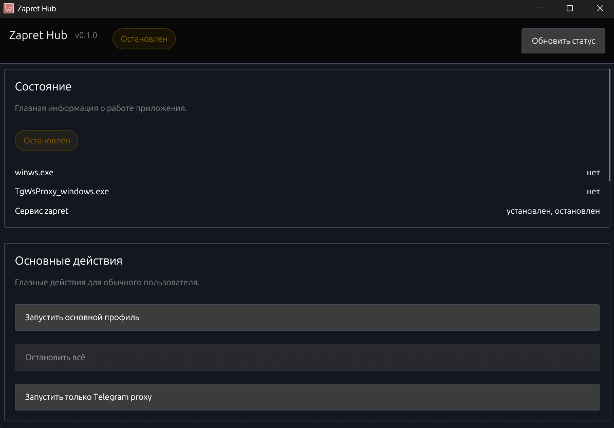

# Zapret Hub

`Zapret Hub` это Windows-приложение-оболочка для готового локального `zapret`-bundle.

Этот репозиторий не реализует сам bypass-движок. Он даёт нативный GUI, упаковку, проверки статуса и более удобное управление уже существующим Windows-набором, в котором есть профили, helper-скрипты, `winws`, `WinDivert` и Telegram proxy.



## Что делает проект

- запускает основной подготовленный профиль
- запускает запасные профили из bundle
- запускает и останавливает Telegram proxy
- останавливает активные bypass-процессы
- открывает оригинальный менеджер сервиса из bundle
- применяет небольшой пресет «настроить для друзей»
- поддерживает автозапуск приложения вместе с Windows
- собирает приложение и bundle в обычный Windows-инсталлер

## Чего проект не делает

- это не замена `zapret`
- это не собственная реализация DPI bypass
- проект не претендует на авторство базового bypass-стека
- он не заменяет оригинальные bundle-скрипты и их сетевую логику

Фактическое bypass-поведение по-прежнему идёт из shipped bundle и его upstream-проектов.

## Как это выглядит после установки

```text
Zapret Hub/
  Zapret Hub.exe
  bundle/
    ...
```

Во время работы приложение сначала ищет `bundle/` рядом с `Zapret Hub.exe`.

## Текущие возможности

- нативный desktop UI на Rust с `egui` / `eframe`
- запуск только одного экземпляра приложения
- проверка статуса:
  - `winws.exe`
  - `TgWsProxy_windows.exe`
  - Windows-сервис `zapret`
- запуск основного профиля:
  - `SIMPLE FAKE ALT2`
- запуск запасных профилей:
  - `ALT11`
  - `FAKE TLS AUTO ALT3`
  - `ALT7`
- запуск Telegram proxy
- действие «остановить всё» для известных связанных процессов
- сервисные действия:
  - установить сервис
  - удалить сервис
  - открыть оригинальный `service.bat`
- автозапуск приложения через Windows Task Scheduler
- сборка инсталлера через Inno Setup

## Структура репозитория

```text
zapret-hub-rs/
  src/
    main.rs
    app.rs
    core/
      autostart.rs
      build_info.rs
      config.rs
      paths.rs
      process.rs
      status.rs
    zapret/
      bundle.rs
    screen/
      menu_hub.png
  installer/
    zapret-hub.iss
  packaging/
    build-installer.ps1
    stage-release.ps1
    generate-update-manifest.ps1
  docs/
    ARCHITECTURE.md
    RELEASE.md
```

## Что нужно для сборки

- Windows
- Rust `1.94+`
- Inno Setup 6

## Локальная сборка

```powershell
cargo build
```

## Release-сборка

```powershell
cargo build --release
```

## Сборка инсталлера

Если использовать bundle по умолчанию:

```powershell
powershell -ExecutionPolicy Bypass -File .\packaging\build-installer.ps1
```

Если использовать свой путь к bundle:

```powershell
powershell -ExecutionPolicy Bypass -File .\packaging\build-installer.ps1 -BundlePath "D:\some\bundle"
```

Результат:

- инсталлер: `dist\installer\zapret-hub-setup-<version>.exe`
- manifest: `dist\installer\latest.json`

## Установка и обновления

- распространять нужно инсталлер, а не только `.exe`
- новый инсталлер обновляет существующую установку поверх старой
- `AppId` в Inno Setup должен оставаться тем же
- перед релизом нужно повышать `version` в `Cargo.toml`

Сейчас модель обновления installer-based. `latest.json` уже генерируется под будущую проверку обновлений, но реальная доставка идёт через setup-файл.

## Credits и upstream-проекты

Этот репозиторий является оболочкой поверх внешних инструментов и bundle-логики. Основные проекты, на которые он опирается:

- `zapret` от bol-van: [github.com/bol-van/zapret](https://github.com/bol-van/zapret)
- lineage Windows-bundle, с которым здесь идёт работа: [github.com/Flowseal/zapret-discord-youtube](https://github.com/Flowseal/zapret-discord-youtube)
- Telegram WS proxy из этого же набора: [github.com/Flowseal/tg-ws-proxy](https://github.com/Flowseal/tg-ws-proxy)
- `WinDivert`: [reqrypt.org/windivert.html](https://reqrypt.org/windivert.html)
- Telegram Desktop: [github.com/telegramdesktop/tdesktop](https://github.com/telegramdesktop/tdesktop)
- `egui`: [github.com/emilk/egui](https://github.com/emilk/egui)
- `eframe`: [github.com/emilk/egui/tree/master/crates/eframe](https://github.com/emilk/egui/tree/master/crates/eframe)
- Inno Setup: [jrsoftware.org/isinfo.php](https://jrsoftware.org/isinfo.php)

## Дополнительно

- архитектурные заметки: [ARCHITECTURE.md](docs/ARCHITECTURE.md)
- release flow: [RELEASE.md](docs/RELEASE.md)
- настройка Telegram `CF media`: [TELEGRAM_CF_MEDIA.md](docs/TELEGRAM_CF_MEDIA.md)

Если форкать или распространять это приложение дальше, лучше сохранять upstream credits. GUI и packaging layer здесь наши, но базовый bypass-стек не наш.
